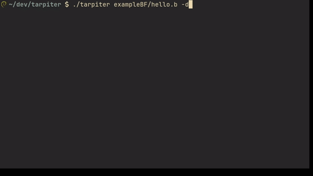

# Tarpiter 

Tarpiter is a [Brainfuck](https://en.wikipedia.org/wiki/Brainfuck) interpreter with an integrated debugger. This tool allows you to run and debug programs written in Brainfuck. It supports step-by-step execution, program state inspection, and simple optimizations.

## Features

- **Interpret BF Programs**: Execute programs written in Brainfuck.
- **Debug Mode**: Step through instructions, inspect memory, and view program output in real-time.
- **Optimizations**: Simple optimizations to merge consecutive similar instructions for faster execution.

## Usage



### Running the Program

To run a program, use the following command:

```bash
./tarpiter <file> [options]
```

### Options

- `-h, --help`: Show the help message.
- `-d, --debug`: Run the program in debug mode.

### Debug Mode

In debug mode, the following commands are available:

- `[Enter]`: Evaluate a single instruction.
- `<N> [Enter]`: Evaluate the next `N` instructions.
- `[R]eset`: Reset the debugger.
- `[Q]uit`: Exit the debugger.

## Example

```bash
./tarpiter exampleBF/hello.b
```

To run the program in debug mode:

```bash
./tarpiter exampleBF/hello.b -d
```

## Building

To build the project, ensure you have make and a C compiler installed. This works out of the box in UNIX and in WSL2 for Windows. Then run:

```bash
make
```

This compiles the program and moves the resulting executable to `$HOME/.local/bin/`, make sure this directory is on your `$PATH`. Alternatively move the executable to another directory on your `$PATH`.

## License

This project is licensed under the MIT License. See the [LICENSE](LICENSE) file for details.
